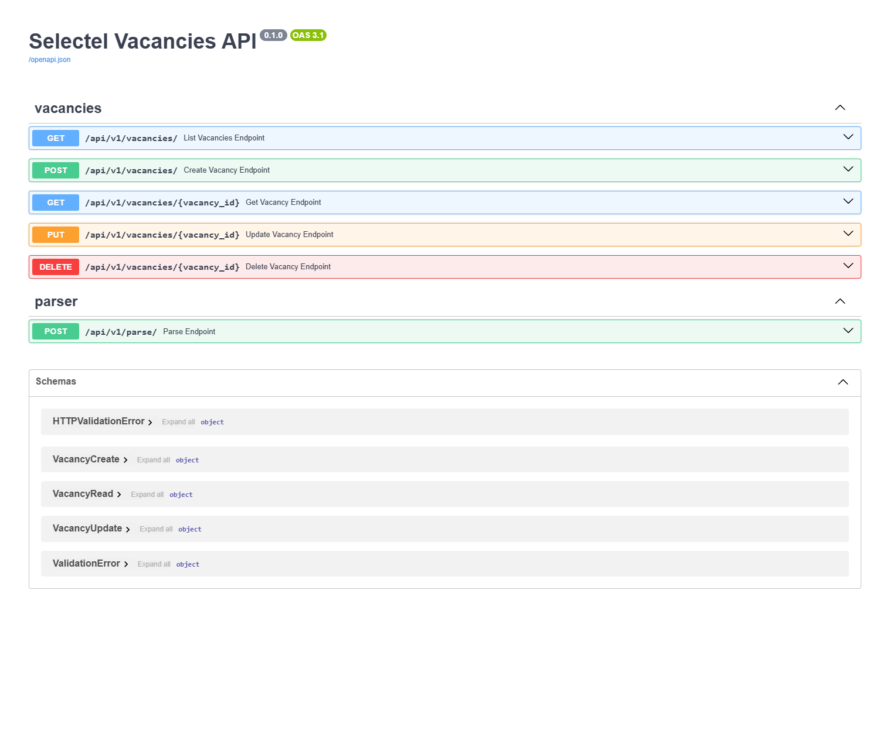
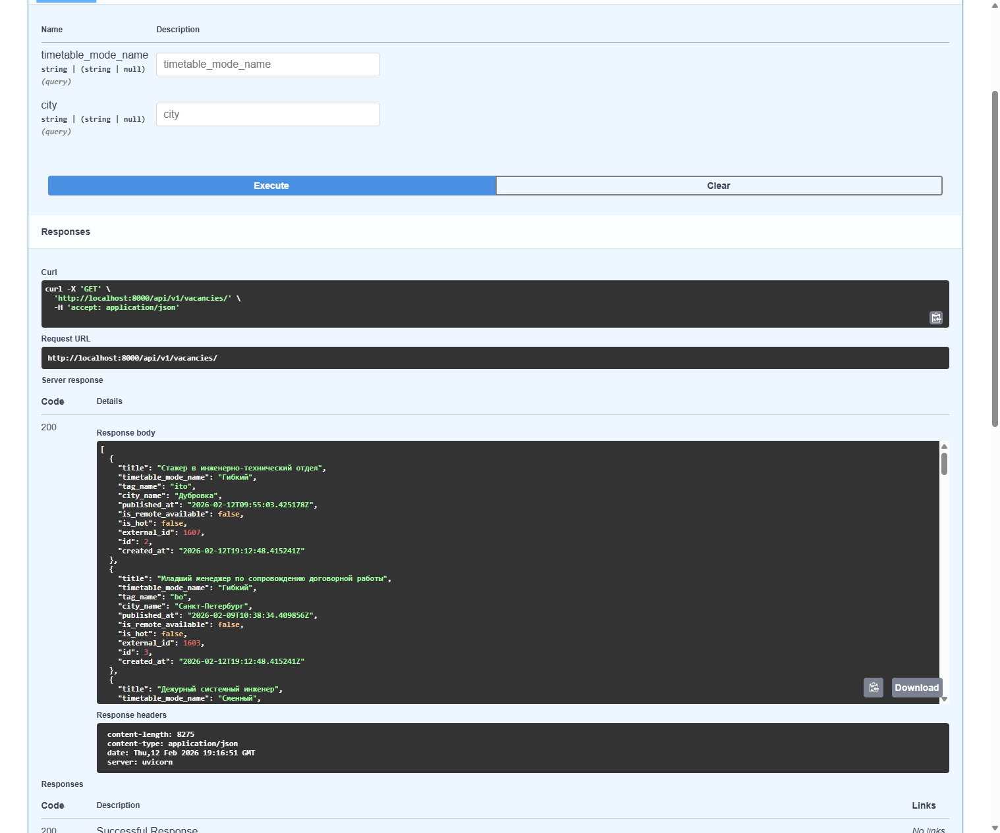
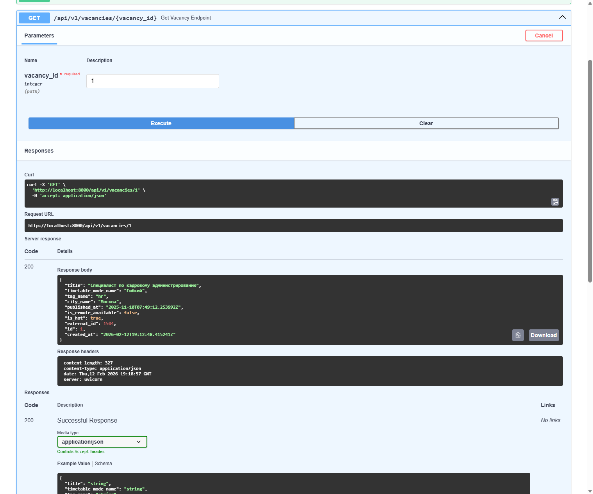
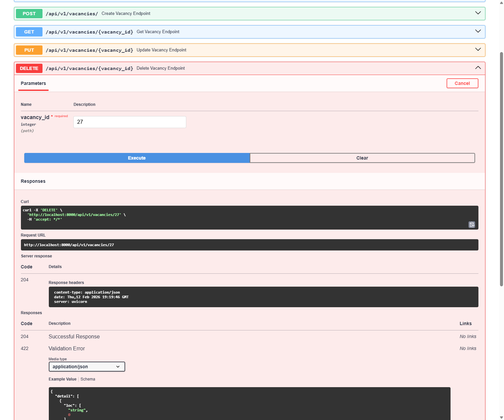
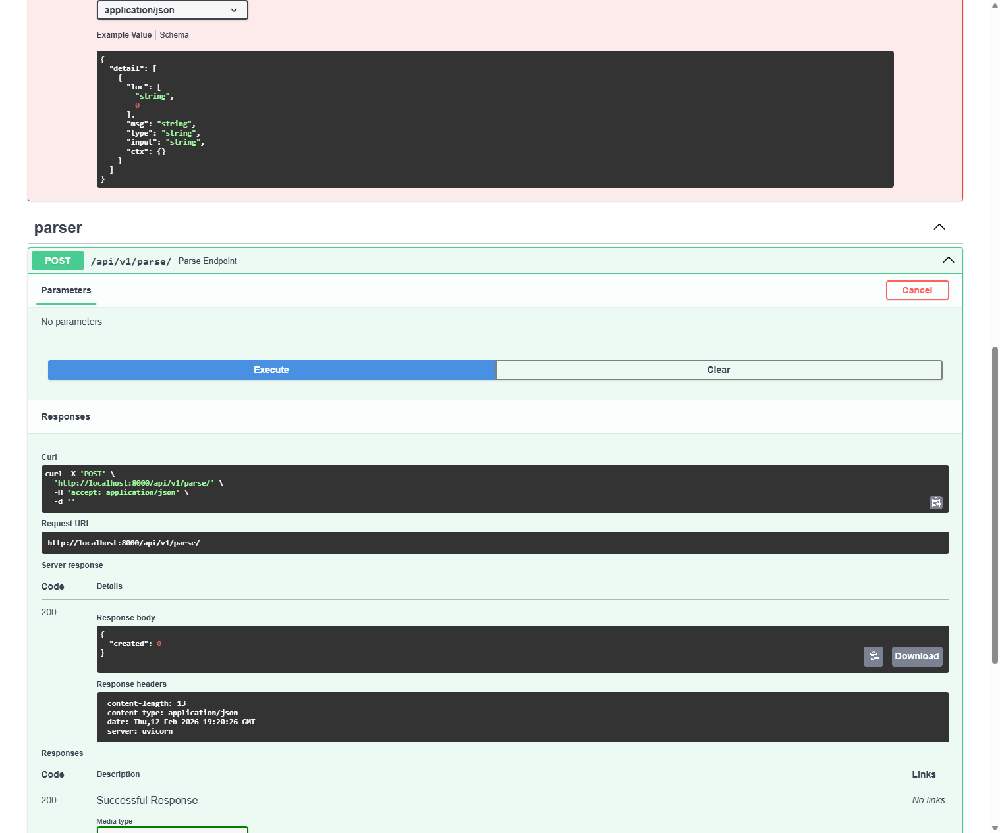

# Отчёт по отладке приложения Selectel Vacancies API

## Шаг 1: Анализ и запуск

* **Что сделал:** Изучил структуру проекта, файлы конфигурации, исходный код всех модулей. Подготовил окружение: установил PostgreSQL, создал виртуальное окружение Python, установил зависимости из `requirements.txt`, создал `.env` файл на основе `.env.example`, применил миграции Alembic, запустил приложение через `uvicorn`.
* **Проблема:** При первом запуске приложение не могло подключиться к базе данных, т.к. использовался неверный URL подключения.
* **Причина:** Два бага в файле конфигурации (баги №1 и №2) препятствовали корректному чтению переменной окружения `DATABASE_URL`.

---

## Шаг 2: Исправление бага №1. Опечатка в `validation_alias`

* **Описание проблемы:** Переменная окружения `DATABASE_URL` из файла `.env` не считывается приложением. Вместо неё используется значение по умолчанию с некорректным именем базы данных. Приложение не может подключиться к PostgreSQL.
* **Файл и строка:** `app/core/config.py:14`
* **Код до:**
```python
database_url: str = Field(
    "postgresql+asyncpg://postgres:postgres@db:5432/postgres_typo",
    validation_alias="DATABSE_URL",
)
```
* **Код после:**
```python
database_url: str = Field(
    "postgresql+asyncpg://postgres:postgres@db:5432/postgres",
    validation_alias="DATABASE_URL",
)
```
* **Причина:** В `validation_alias` допущена опечатка: `DATABSE_URL` (пропущена буква «A»). Pydantic Settings ищет переменную окружения с именем `DATABSE_URL`, но в `.env` файле определена `DATABASE_URL`. Из-за несовпадения имён переменная не считывается и используется значение по умолчанию.

---

## Шаг 3: Исправление бага №2. Неверное имя базы данных по умолчанию

* **Описание проблемы:** Значение по умолчанию для `database_url` содержит имя базы данных `postgres_typo`, которая не существует.
* **Файл и строка:** `app/core/config.py:13`
* **Код до:**
```python
"postgresql+asyncpg://postgres:postgres@db:5432/postgres_typo",
```
* **Код после:**
```python
"postgresql+asyncpg://postgres:postgres@db:5432/postgres",
```
* **Причина:** Имя базы данных в строке подключения по умолчанию `postgres_typo` вместо `postgres`, поэтому подключение к `postgres_typo` завершается ошибкой.

---

## Шаг 4: Исправление бага №3. `AttributeError` при парсинге вакансий без города

* **Описание проблемы:** При парсинге вакансий с внешнего API приложение падает с ошибкой `AttributeError: 'NoneType' object has no attribute 'name'`. Парсинг вакансий не завершается, данные не сохраняются.
* **Файл и строка:** `app/services/parser.py:43`
* **Код до:**
```python
"city_name": item.city.name.strip(),
```
* **Код после:**
```python
"city_name": item.city.name.strip() if item.city else None,
```
* **Причина:** Поле `city` в схеме внешнего API определено как `Optional[ExternalCity]`, для удалённых вакансий оно равно `None`. При обращении к `item.city.name` происходит попытка вызвать атрибут `name` у `None`, что вызывает `AttributeError`. Необходима проверка на `None` перед доступом к вложенным полям.

---

## Шаг 5: Исправление бага №4. Неправильная единица времени в планировщике

* **Описание проблемы:** Фоновый парсинг вакансий запускается каждые 5 **секунд** вместо заявленных 5 **минут**.
* **Файл и строка:** `app/services/scheduler.py:13`
* **Код до:**
```python
scheduler.add_job(
    job,
    trigger="interval",
    seconds=settings.parse_schedule_minutes,
    ...
)
```
* **Код после:**
```python
scheduler.add_job(
    job,
    trigger="interval",
    minutes=settings.parse_schedule_minutes,
    ...
)
```
* **Причина:** Параметр `seconds=settings.parse_schedule_minutes` передаёт значение 5 как секунды, а не минуты.

---

## Шаг 6: Исправление бага №5. Некорректный ответ при дублировании `external_id`

* **Описание проблемы:** При попытке создать вакансию с уже существующим `external_id` эндпоинт `POST /api/v1/vacancies/` возвращает `JSONResponse` с кодом 200, что нарушает контракт API (объявлен `response_model=VacancyRead`). Клиент получает `{"detail": "..."}` вместо ожидаемой структуры `VacancyRead` или корректной ошибки.
* **Файл и строка:** `app/api/v1/vacancies.py:52-55`
* **Код до:**
```python
if existing:
    return JSONResponse(
        status_code=status.HTTP_200_OK,
        content={"detail": "Vacancy with external_id already exists"},
    )
```
* **Код после:**
```python
if existing:
    raise HTTPException(
        status_code=status.HTTP_409_CONFLICT,
        detail="Vacancy with this external_id already exists",
    )
```
* **Причина:** `JSONResponse` обходит валидацию `response_model` в FastAPI и возвращает произвольный JSON. Необходимо выбросить `HTTPException` с кодом 409.

---

## Шаг 7: Исправление бага №6. Утечка ресурса `httpx.AsyncClient`

* **Описание проблемы:** HTTP-клиент `httpx.AsyncClient` создаётся, но никогда не закрывается. Это приводит к утечке соединений и ресурсов при каждом цикле парсинга.
* **Файл и строка:** `app/services/parser.py:31`
* **Код до:**
```python
client = httpx.AsyncClient(timeout=timeout)
page = 1
while True:
    ...
```
* **Код после:**
```python
async with httpx.AsyncClient(timeout=timeout) as client:
    page = 1
    while True:
        ...
```
* **Причина:** `httpx.AsyncClient` управляет пулом соединений и должен быть корректно закрыт после использования, чтобы со временем это не привело к исчерпанию файловых дескрипторов.

---

## Шаг 8: Исправление бага №7. Фиктивная зависимость в `requirements.txt`

* **Описание проблемы:** В файле зависимостей присутствует строка, указывающая на несуществующую версию `fastapi`. Потенциально может вызвать ошибку при сборке в определённых окружениях.
* **Файл и строка:** `requirements.txt:10`
* **Код до:**
```
apscheduler
fastapi==999.0.0; python_version < "3.8"
```
* **Код после:**
```
apscheduler
```
* **Причина:** Строка `fastapi==999.0.0; python_version < "3.8"` указывает на несуществующую версию FastAPI 999.0.0, потенциально может вызвать проблемы при нестандартных конфигурациях.

---

## Шаг 9: Исправление бага №8. Перезапись полей при обновлении вакансии

* **Описание проблемы:** При обновлении вакансии через `PUT /api/v1/vacancies/{id}` все поля, не указанные в запросе, сбрасываются в значения по умолчанию (например, `external_id` становится `None`). Это приводит к потере данных.
* **Файл и строка:** `app/crud/vacancy.py:50`
* **Код до:**
```python
for field, value in data.model_dump().items():
    setattr(vacancy, field, value)
```
* **Код после:**
```python
for field, value in data.model_dump(exclude_unset=True).items():
    setattr(vacancy, field, value)
```
* **Причина:** Метод `model_dump()` без параметров возвращает все поля модели, включая те, которые клиент не передавал в запросе, заполняются значениями по умолчанию (например, `external_id=None`, `city_name=None`). Параметр `exclude_unset=True` гарантирует, что обновляются только те поля, которые были явно указаны клиентом.

---

## Итог

* Все 8 багов обнаружены и исправлены.
* Приложение успешно запускается без ошибок.
* Парсинг вакансий выполняется корректно.
* Все CRUD-операции работают корректно:
* Фоновая задача парсинга работает каждые 5 минут.
* Приложение возвращает корректные HTTP-статусы и данные.

## Скриншоты Swagger UI

1. **Главная страница Swagger UI**:
   

2. **GET /api/v1/vacancies/** список вакансий, 200 OK:
   

3. **POST /api/v1/vacancies/** создание вакансии, 201 Created:
   

4. **GET /api/v1/vacancies/1** получение вакансии по ID, 200 OK:
   

5. **DELETE /api/v1/vacancies/27** удаление вакансии, 204 No Content:
   

6. **POST /api/v1/parse/** ручной запуск парсинга, 200 OK:
   

